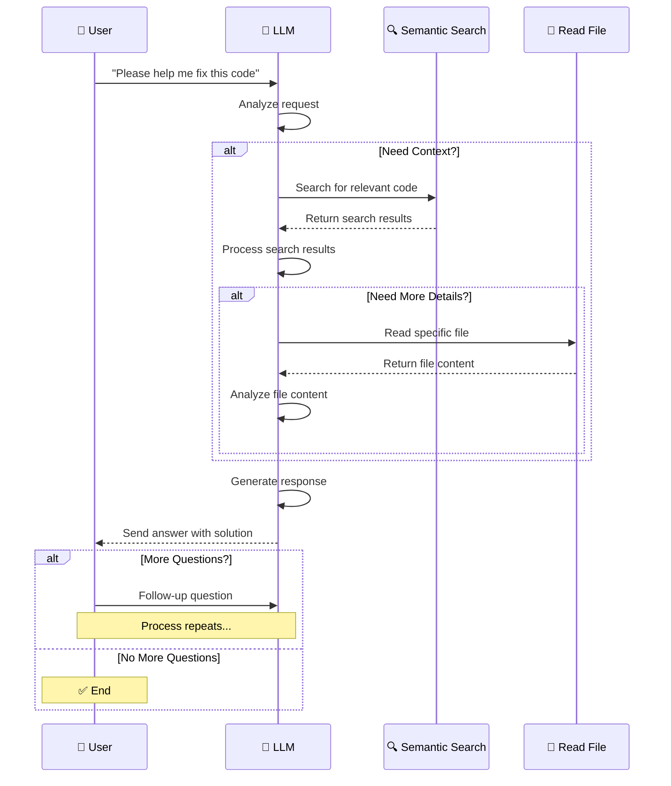

# Code Indexing Prompts & Testing

> This folder contains prompts and testing for converting source code into structured repository maps that look like Aider's repomap format. The maps contain key symbols (classes, functions, interfaces) with their signatures, optimized for semantic search and LLM understanding. [Reference: Aider Repomap](https://aider.chat/docs/repomap.html)

### **What's Included**

1. **System Prompts** - Structured prompts for LLM processing
2. **Testing Data** - Performance comparison across different models
3. **Examples** - Sample code and expected repository map outputs
4. **Documentation** - How to use the prompts for indexing

**Example:**

```typescript
interface User {
  id: number;
  name: string;
  email: string;
}

class UserService {
  private users: User[] = [];

  addUser(user: User): void {
    this.users.push(user);
  }

  getUserById(id: number): User | null {
    return this.users.find((u) => u.id === id) || null;
  }
}
```

**Becomes:**

```
@@ /src/utils/helper.ts
⋮... // User interface and service definitions
│interface User {
│  id: number
│  name: string
│  email: string
│}
⋮... // UserService class with CRUD operations
│class UserService {
│  private users: User[]
│  addUser(user: User): void
│  getUserById(id: number): User | null
│}
```

---

## 🔄 Workflow

### Indexing Process

The indexing workflow converts raw source code into structured repository maps that are optimized for semantic search and LLM understanding. This process creates a searchable knowledge base of your codebase without requiring complex AST parsing.


**Detailed Steps:**

1. **📁 Scan Workspace** - Discover all source code files recursively
2. **📄 Read Files** - Extract file contents with absolute paths for context
3. **🤖 Send to LLM** - Process files with specialized prompts for code understanding
4. **🗂️ Generate Repo Map** - Create Aider-format maps with key symbols and context
5. **💾 Store to Database** - Persist maps for fast semantic search retrieval

> **Note**: Vector databases are not required for this indexing approach. Both **SQL** and **NoSQL** databases are suitable for storing the generated repository maps. The structured format allows for efficient text-based search and retrieval.

### Retrieval Process

The retrieval workflow enables intelligent code assistance by allowing the LLM to dynamically search and read relevant code sections based on user queries. This creates a conversational coding experience where the AI can understand context and provide targeted help.

**System Requirements:**

- **Semantic Search Tool** (Required) - Enables finding relevant code sections based on meaning
- **Read File Tool** (Required) - Allows reading specific files for detailed analysis

**Process Flow:**

- **User Query** → User asks for help (e.g., "please help me fix this code")
- **LLM Analysis** → AI determines if additional context is needed
- **Context Search** → If needed, LLM calls Semantic Search to find relevant code
- **Detailed Analysis** → If more details required, LLM reads specific files
- **Response Generation** → LLM processes all information and provides solution
- **Iterative Loop** → Process repeats for follow-up questions until user is satisfied



---

## 📝 How to Index Code

This section explains how to implement the code indexing system. The process requires minimal setup and provides structured code analysis for semantic search.

### **Quick Steps**

1. **Send code to LLM** with specialized system prompt that understands code structure
2. **Get repository map** in standardized Aider format with key symbols and context
3. **Save for semantic search** by storing the structured maps in your preferred database

### **Implementation Details**

**Prerequisites:**

- Access to an LLM API (Ollama, OpenAI, Anthropic, etc.)
- Database for storing repository maps (SQLite, PostgreSQL, MongoDB, etc.)
- File system access to scan and read source code files

**Key Benefits:**

- **No AST Parsing Required** - Let the LLM handle code understanding
- **Language Agnostic** - Works with any programming language the LLM understands
- **Context Aware** - Captures relationships between symbols and their usage
- **Search Optimized** - Output format is designed for efficient semantic search

### **Example Request**

````json
{
  "model": "deepseek-v3.1:671b",
  "messages": [
    {
      "role": "system",
      "content": "Convert code to repository map format..."
    },
    {
      "role": "user",
      "content": "File: /src/utils/helper.ts\n\n```typescript\ninte..."
    }
  ],
  "format": {
    "type": "object",
    "properties": {
      "content": { "type": "string" },
      "description": { "type": "string" },
      "keywords": { "type": "string" }
    },
    "required": ["content", "description", "keywords"]
  }
}
````

### **Example Output**

```json
{
  "content": "@@ /src/utils/helper.ts\n⋮... // User ....",
  "description": "User interface and service for managing users",
  "keywords": "keyword 1, keyword 2, ..."
}
```

**🤖 [View System Prompt](./prompt/system.md)** - _System prompt for code indexing_  
**👤 [View User Prompt](./prompt/user.md)** - _User prompt template for code indexing_

---

## 📊 Performance Comparison

Our comprehensive testing across different AI models reveals significant performance variations. The benchmarks were conducted using real-world codebases with varying complexity levels, measuring both processing speed and output accuracy.

**Testing Methodology:**

- **Dataset**: 100+ code files across multiple languages (TypeScript, Python, JavaScript, Go)
- **Metrics**: Processing time per file and accuracy of generated repository maps
- **Accuracy**: Measured by manual review of symbol extraction, signature correctness, and context preservation

**📋 [View Testing Documentation](./testing.md)** - _Detailed testing procedures and methodology_

| Model                             | Speed | Accuracy | Recommendation             |
| --------------------------------- | ----- | -------- | -------------------------- |
| **deepseek-v3.1:671b** (no-think) | 2.05s | 90%      | ⭐ **Best Overall**        |
| **deepseek-v3.1:671b** (think)    | 2.51s | 95%      | ⭐ **Most Accurate**       |
| **qwen3-coder:480b** (no-think)   | 2.43s | 80%      | ⭐ **Fast & Good**         |
| **gpt-oss:20b** (no-think)        | 2.33s | 60%      | ⚠️ **Fast but Inaccurate** |

**Performance Insights:**

- **Speed vs Accuracy Trade-off**: Models with "think" mode show higher accuracy but slower processing
- **Model Size Impact**: Larger models generally provide better accuracy but require more resources
- **Consistency**: deepseek-v3.1 shows the most consistent performance across different code types
- **Resource Usage**: Consider your infrastructure capabilities when choosing between speed and accuracy

**📁 [View Detailed Comparison Results](./comparison)** - _Raw performance data and test results_

---

## 📄 License

This project is licensed under the MIT License - see the [LICENSE](LICENSE) file for details.

---

## 📚 References

- [Aider Repomap Documentation](https://aider.chat/docs/repomap.html) - _Inspiration for repo map format_
- [Ollama Tool Support](https://ollama.com/blog/tool-support) - _Tool calling capabilities for retrieval workflow_
- [Ollama Blog](https://ollama.com/blog) - _Latest features and capabilities_
