# Code Indexing Prompts & Testing

<div align="center">
  
</div>

> This folder contains prompts and testing for converting source code into structured repository maps that look like Aider's repomap format. The maps contain key symbols (classes, functions, interfaces) with their signatures, optimized for semantic search and LLM understanding. [Reference: Aider Repomap](https://aider.chat/docs/repomap.html)

### **What's Included**

1. **System Prompts** - Structured prompts for LLM processing
2. **Testing Data** - Performance comparison across different models
3. **Examples** - Sample code and expected repository map outputs
4. **Documentation** - How to use the prompts for indexing
5. **CLI Scripts** - Ready-to-use tool calling examples and workflows ([📁 View Scripts](./scripts/))

### **🚀 Quick Start with CLI Scripts**

Get started immediately with our command-line interface that provides ready-to-use examples:

```bash
# Initialize the database
npx tsx ./scripts/index.ts init

# Index your codebase
npx tsx ./scripts/index.ts indexing

# Run tool calling example
npx tsx ./scripts/index.ts tool-calling

# Show help
npx tsx ./scripts/index.ts help
```

> **⚠️ Configuration Required**: Set your API key if you're using the Ollama endpoint. Edit the code in the `./scripts` folder to configure your credentials.

**Available Commands:**

- `init` - Initialize the database with proper schema
- `indexing` - Process and index your entire codebase
- `tool-calling` - Demonstrate semantic search and tool calling workflow
- `help` - Display available commands and usage

**Example:**

```typescript
interface User {
  id: number;
  name: string;
  email: string;
}

class UserService {
  private users: User[] = [];

  addUser(user: User): void {
    this.users.push(user);
  }

  getUserById(id: number): User | null {
    return this.users.find((u) => u.id === id) || null;
  }
}
```

**Becomes:**

```
@@ /src/utils/helper.ts
⋮... // User interface and service definitions
│interface User {
│  id: number
│  name: string
│  email: string
│}
⋮... // UserService class with CRUD operations
│class UserService {
│  private users: User[]
│  addUser(user: User): void
│  getUserById(id: number): User | null
│}
```

---

## 🔄 Workflow

### Indexing Process

The indexing workflow converts raw source code into structured repository maps that are optimized for semantic search and LLM understanding. This process creates a searchable knowledge base of your codebase without requiring complex AST parsing.


**Detailed Steps:**

1. **📁 Scan Workspace** - Discover all source code files recursively
2. **📄 Read Files** - Extract file contents with absolute paths for context
3. **🤖 Send to LLM** - Process files with specialized prompts for code understanding
4. **🗂️ Generate Repo Map** - Create Aider-format maps with key symbols and context
5. **💾 Store to Database** - Persist maps for fast semantic search retrieval

> **Note**: Vector databases are not required for this indexing approach. Both **SQL** and **NoSQL** databases are suitable for storing the generated repository maps. The structured format allows for efficient text-based search and retrieval.

### Retrieval Process

The retrieval workflow enables intelligent code assistance by allowing the LLM to dynamically search and read relevant code sections based on user queries. This creates a conversational coding experience where the AI can understand context and provide targeted help.

**System Requirements:**

- **Semantic Search Tool** (Required) - Enables finding relevant code sections based on meaning
- **Read File Tool** (Required) - Allows reading specific files for detailed analysis

**Process Flow:**

- **User Query** → User asks for help (e.g., "please help me fix this code")
- **LLM Analysis** → AI determines if additional context is needed
- **Context Search** → If needed, LLM calls Semantic Search to find relevant code
- **Detailed Analysis** → If more details required, LLM reads specific files
- **Response Generation** → LLM processes all information and provides solution
- **Iterative Loop** → Process repeats for follow-up questions until user is satisfied

```mermaid
sequenceDiagram
    participant U as 👤 User
    participant L as 🤖 LLM
    participant S as 🔍 Semantic Search
    participant F as 📄 Read File

    U->>L: "Please help me fix this code"
    L->>L: Analyze request

    alt Need Context?
        L->>S: Search for relevant code
        S-->>L: Return search results
        L->>L: Process search results

        alt Need More Details?
            L->>F: Read specific file
            F-->>L: Return file content
            L->>L: Analyze file content
        end
    end

    L->>L: Generate response
    L-->>U: Send answer with solution

    alt More Questions?
        U->>L: Follow-up question
        Note over U,L: Process repeats...
    else No More Questions
        Note over U: ✅ End
    end
```



---

## 📝 How to Index Code

This section explains how to implement the code indexing system. The process requires minimal setup and provides structured code analysis for semantic search.

### **Quick Steps**

1. **Send code to LLM** with specialized system prompt that understands code structure
2. **Get repository map** in standardized Aider format with key symbols and context
3. **Save for semantic search** by storing the structured maps in your preferred database

### **Implementation Details**

**Prerequisites:**

- Access to an LLM API (Ollama, OpenAI, Anthropic, etc.)
- Database for storing repository maps (SQLite, PostgreSQL, MongoDB, etc.)
- File system access to scan and read source code files

**Key Benefits:**

- **No AST Parsing Required** - Let the LLM handle code understanding
- **Language Agnostic** - Works with any programming language the LLM understands
- **Context Aware** - Captures relationships between symbols and their usage
- **Search Optimized** - Output format is designed for efficient semantic search

### **Example Request**

````json
{
  "model": "deepseek-v3.1:671b",
  "messages": [
    {
      "role": "system",
      "content": "Convert code to repository map format..."
    },
    {
      "role": "user",
      "content": "File: /src/utils/helper.ts\n\n```typescript\ninte..."
    }
  ],
  "format": {
    "type": "object",
    "properties": {
      "content": { "type": "string" },
      "description": { "type": "string" },
      "keywords": { "type": "string" }
    },
    "required": ["content", "description", "keywords"]
  }
}
````

### **Example Output**

```json
{
  "content": "@@ /src/utils/helper.ts\n⋮... // User ....",
  "description": "User interface and service for managing users",
  "keywords": "keyword 1, keyword 2, ..."
}
```

**🤖 [View System Prompt](./prompt/system.md)** - _System prompt for code indexing_  
**👤 [View User Prompt](./prompt/user.md)** - _User prompt template for code indexing_

---

## 📊 Performance Comparison

Our comprehensive testing across different AI models reveals significant performance variations. The benchmarks were conducted using real-world codebases with varying complexity levels, measuring both processing speed and output accuracy.

**Testing Methodology:**

- **Dataset**: 100+ code files across multiple languages (TypeScript, Python, JavaScript, Go)
- **Metrics**: Processing time per file and accuracy of generated repository maps
- **Accuracy**: Measured by manual review of symbol extraction, signature correctness, and context preservation
- **Test Environment**: MacBook Pro (M3 Pro, 11 cores, 18GB RAM) running macOS 26.0

**📋 [View Testing Documentation](./testing.md)** - _Detailed testing procedures and methodology_

### 🌐 Cloud Models

| Model                             | Speed      | Accuracy | Duration | Content | Think Mode | Recommendation            |
| --------------------------------- | ---------- | -------- | -------- | ------- | ---------- | ------------------------- |
| **deepseek-v3.1:671b** (no-think) | 50.85 t/s  | 70%      | 11.99s   | 2,117   | No         | ⭐ **Good Content**       |
| **deepseek-v3.1:671b** (think)    | 63.58 t/s  | 65%      | 86.74s   | 1,503   | Yes        | ⚠️ **Slow but Detailed**  |
| **gpt-oss:120b** (no-think)       | 141.99 t/s | 70%      | 7.21s    | 1,364   | No         | ⭐ **Fast & Good**        |
| **gpt-oss:120b** (think-high)     | 185.83 t/s | 60%      | 45.66s   | 672     | High       | ⚠️ **Fast but Short**     |
| **gpt-oss:120b** (think-low)      | 148.75 t/s | 70%      | 4.15s    | 1,707   | Low        | ⭐ **Best Balance**       |
| **gpt-oss:120b** (think-medium)   | 170.24 t/s | 65%      | 7.32s    | 1,521   | Medium     | ⭐ **Good Speed/Quality** |
| **gpt-oss:20b** (no-think)        | 216.40 t/s | 70%      | 37.65s   | 1,174   | No         | ⭐ **Fast Processing**    |
| **gpt-oss:20b** (think-high)      | 0.00 t/s   | 0%       | 0.00s    | 0       | High       | ❌ **Failed**             |
| **gpt-oss:20b** (think-low)       | 0.00 t/s   | 0%       | 0.00s    | 0       | Low        | ❌ **Failed**             |
| **gpt-oss:20b** (think-medium)    | 318.40 t/s | 70%      | 5.27s    | 1,223   | Medium     | ⭐ **Fastest**            |
| **qwen3-coder:480b** (no-think)   | 72.75 t/s  | 70%      | 8.47s    | 2,223   | No         | ⭐ **Best Content**       |

### 🏠 Offline/Local Models

| Model                              | Speed     | Accuracy | Duration | Content | Think Mode | Recommendation           |
| ---------------------------------- | --------- | -------- | -------- | ------- | ---------- | ------------------------ |
| **qwen2.5-coder:1.5b** (no-think)  | 27.63 t/s | 55%      | 11.40s   | 1,055   | No         | ⚠️ **Fair Quality**      |
| **qwen3:1.7b** (no-think)          | 23.41 t/s | 70%      | 13.54s   | 1,058   | No         | ⭐ **Good Performance**  |
| **qwen3:1.7b** (think)             | 44.13 t/s | 70%      | 6.00s    | 779     | Yes        | ⭐ **Good Balance**      |
| **qwen3:4b-instruct** (no-think)   | 14.30 t/s | 70%      | 46.08s   | 2,454   | No         | ⭐ **Good but Slow**     |
| **qwen3:8b** (no-think)            | 6.57 t/s  | 70%      | 84.40s   | 2,035   | No         | ⚠️ **Very Slow**         |
| **qwen3:8b** (think)               | 10.00 t/s | 70%      | 54.65s   | 2,040   | Yes        | ⚠️ **Slow but Detailed** |
| **deepcoder:1.5b** (no-think)      | 39.74 t/s | 30%      | 17.19s   | 787     | No         | ❌ **Poor Performance**  |
| **deepseek-coder:1.3b** (no-think) | 16.76 t/s | 10%      | 8.77s    | 175     | No         | ❌ **Very Poor**         |

> **💻 Hardware Specifications**: All offline models tested on MacBook Pro (M3 Pro, 11 cores, 18GB RAM) running macOS 26.0

**📁 [View Detailed Comparison Results](./comparison)** - _Raw performance data and test results_

---

## 💡 Pro Tips & Best Practices

- **Improve Semantic Accuracy**: Filter by nearest path to enhance search precision
- **Targeted Context**: Use specific file targeting and edit prompts to include relevant context
- **Cloud Models**: We recommend **GPT-OSS 20B (think-medium)** for fastest processing (318.40 tokens/s)
- **Best Balance**: Use **GPT-OSS 120B (think-low)** for optimal speed/quality balance (148.75 tokens/s, 70% accuracy)
- **Offline Capability**: Use **Qwen3:1.7b (think)** for best offline performance (44.13 tokens/s, 70% accuracy)
- **Content Quality**: Use **Qwen3-coder:480b (no-think)** for richest content (2,223 characters)
- **Reliability**: Use **DeepSeek models (clouds)** for 100% success rate
- **Avoid**: **deepcoder:1.5b** and **deepseek-coder:1.3b** performed poorly (30% and 10% scores)
- **Result**: LLM will never be confused again with no complexity behind the scenes

> **Implementation Example**: The [`scripts`](./scripts/) folder provides examples of how to implement this in a simple way, using SQLite for the database. In real applications, you can also index the database and filter with proper algorithms.

> **Pro Tip**: Use root path detection with [`Project-Root`](https://github.com/NeaByteLab/Project-Root) to filter file paths and improve semantic search accuracy. This ensures the system gets proper context by matching project paths, resulting in more accurate and relevant content retrieval.

---

## 📄 License

This project is licensed under the MIT License - see the [LICENSE](LICENSE) file for details.

---

## 📚 References

- [Aider Repomap Documentation](https://aider.chat/docs/repomap.html) - _Inspiration for repo map format_
- [Ollama Tool Support](https://ollama.com/blog/tool-support) - _Tool calling capabilities for retrieval workflow_
- [Ollama Blog](https://ollama.com/blog) - _Latest features and capabilities_
